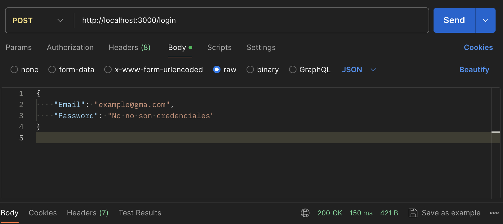
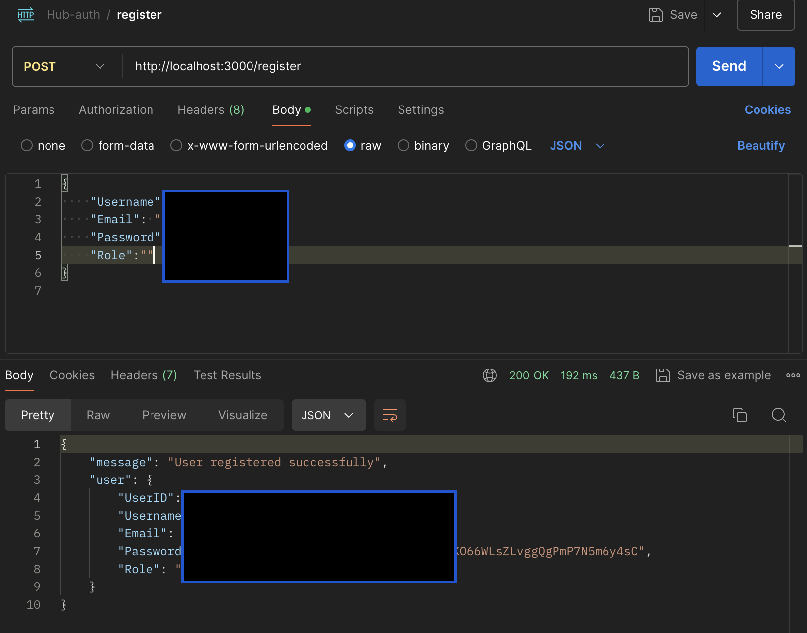
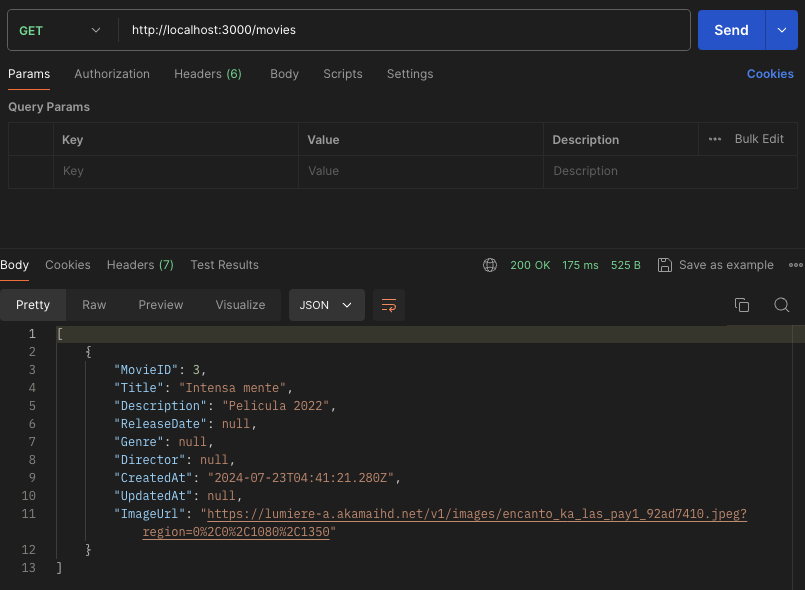
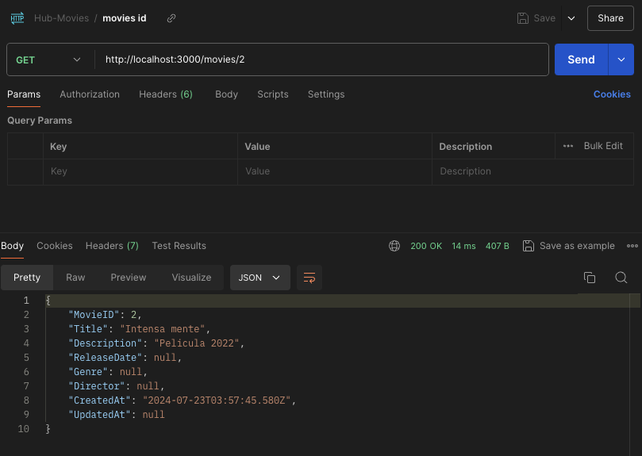
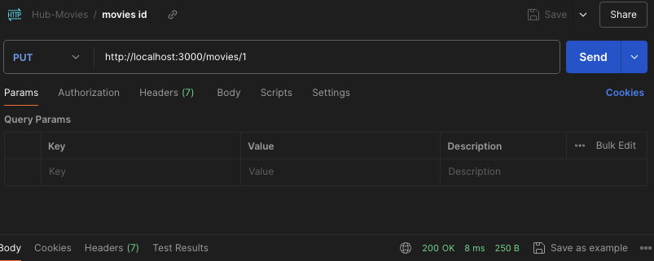
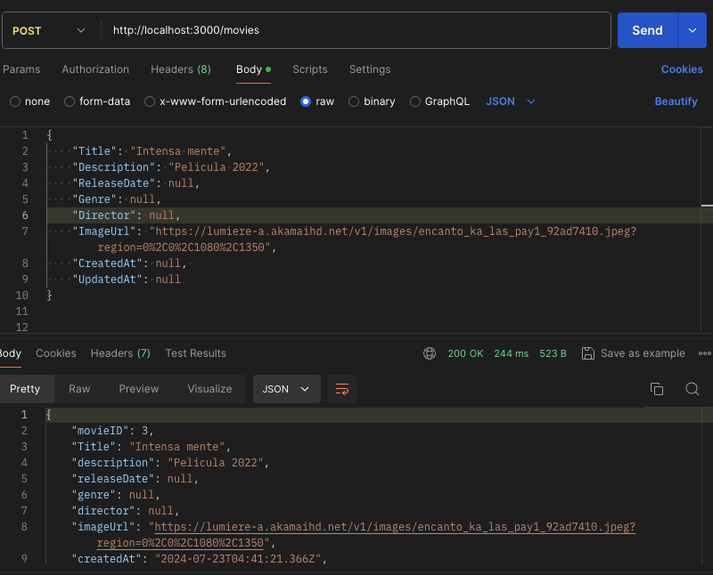
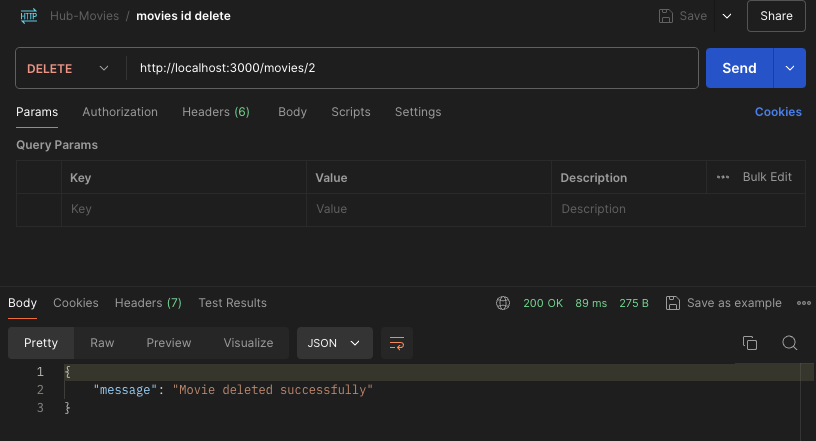
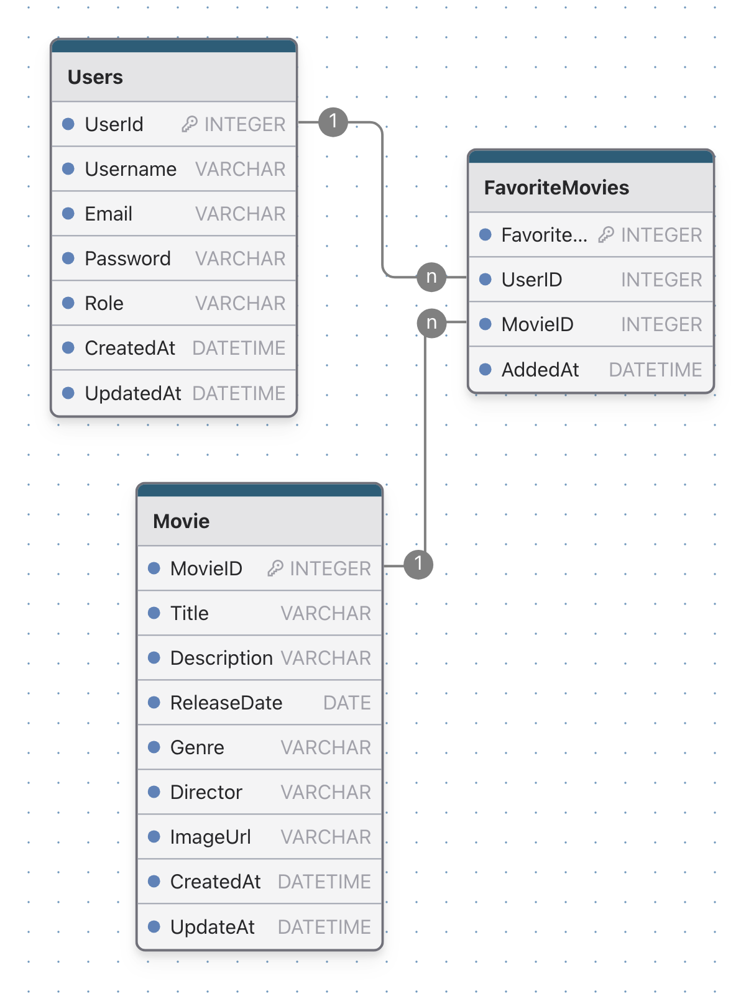

# Back-Hub

This proyect was genereted whit NODE 

## Pedro Damian Gaspar Gallardo

### Back-end to Hub-Entrtenimiento-Mega

El back end esta generado para la aplicacion [Hub de entrtetenimiento] (https://github.com/DamianGallardo/Hub-Entretenimiento-Mega/tree/Sprint-three)

### 2. Requerimientos tecnicos - Todo lo que usaste

Aplicacion con Node con JavaScript, Express y MSSQL

Tecnologias utilizadas 
    "bcryptjs": "^2.4.3",
    "cors": "^2.8.5",
    "dotenv": "^16.4.5",
    "express": "^4.19.2",
    "jsonwebtoken": "^9.0.2",
    "morgan": "^1.10.0",
    "mssql": "^11.0.1"

Respuestas en consola:
    "nodemon": "^3.1.4"

### 4. Capturas de pantalla - 5 capturas con explicacion

## Register y Login de usuario

Login de usuario

Se debe enviar el Email y la contraseña esto regresa un Token.

Register de usuario

Se debe de enviar Usarname, email, password. la contraseña se encripta y se guarda en la base de datos.

## Crud Peliculas

GET ALL 

GET ID

PUT ID

POST 

DELETE

Diagrama Entidad Relacion

### 6. Tabla con Sprint Review 

| Que salio bien?             | Que puedo hacer diferente?                | Que no salio bien ? |
------------------------------|-------------------------------------------|-----------------------
|Conexión a la base de datos. la creacion end points |Tener mas codigos de error | ----
## Development server

Run npm run dev.
